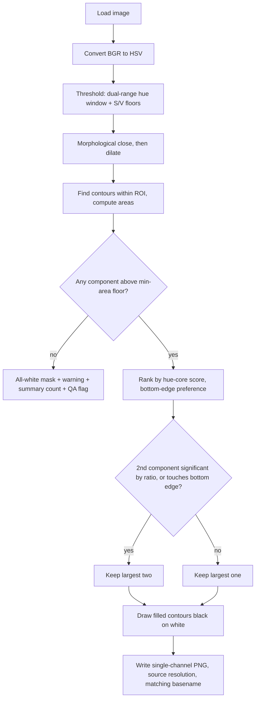

# SO-101 Gripper Mask CLI - Plan

## Goal Capsule

- **Objective:** Build a uv-managed Python CLI that converts a directory of SO-101 wrist-cam images into single-channel PNG gripper masks (0 = gripper, 255 = keep), plus a QA gallery command with a local static server for fast visual review.
- **Authority:** The user's confirmed scope (this document's Product Contract) governs. Where implementation reveals a conflict, the Product Contract wins over the Planning Contract; surface genuine scope conflicts to the user instead of guessing.
- **Execution profile:** Runs on the local aarch64 Jetson. All Python execution through the project's uv environment (`uv run ...`); never the system Python (its cv2 is broken by a NumPy mismatch).
- **Stop conditions:** Stop and surface to the user if color thresholding plus the selection heuristics cannot separate the gripper from the wood-panel background on the reference dataset — do not reach for ML segmentation; that is out of scope.
- **Tail ownership:** After the Definition of Done, remaining tail work (default tuning beyond the reference dataset, other capture sessions) belongs to the user.

---

## Product Contract

### Summary

A Python CLI in a uv-managed project: given an input image directory, an output directory, and a hex base color for the gripper, it runs an HSV-threshold pipeline per image and writes single-channel PNG masks at source resolution with matching basenames. A companion QA command generates a static HTML gallery (original, mask, tinted overlay per image) and serves it locally. Classical CV only.

### Problem Frame

Wrist-cam captures from the SO-101 arm always contain the orange 3D-printed gripper jaws in-frame. Downstream use of these images (robot-learning training data) needs the gripper region masked out, per image, across whole capture sessions. Doing this by hand is infeasible at hundreds of frames per session; the gripper's saturated orange against the scene makes classical color thresholding viable without ML. The masks must be trustworthy enough that a fast human QA pass can catch the failures thresholding will occasionally produce (warm wood background, motion blur, grasped orange-ish objects).

### Requirements

**Masking pipeline**

- R1. The CLI accepts an input image directory, an output mask directory, and a gripper base color as an RGB hex string.
- R2. Each image is converted to HSV and thresholded around the base color (hue window plus saturation/value floors), then morphologically closed and dilated to fill gaps.
- R3. Connected components of the thresholded mask are sorted by area; the largest 1 or 2 are kept — the 2nd only when it is significant relative to the largest (area-ratio rule, with a fallback for a real second finger; see KTD-4).
- R4. Kept components are drawn as filled contours into a single-channel PNG at source resolution, written as `<basename>.png` in the output directory: 0 = gripper/masked area, 255 = keep.

**Robustness**

- R5. A frame where no component passes the minimum-area floor produces an all-white mask, a per-file warning, inclusion in the run summary, and a visible flag in the QA gallery — never a missing file.
- R6. Unreadable or corrupt images are skipped with a warning; the run continues. The process prints a one-line summary (processed / empty / skipped counts) and exits 0 only when every file processed cleanly (see KTD-6 exit-code table).
- R7. All tuning parameters (hue tolerance, saturation/value floors, morphology sizes, dilation, second-component ratio, minimum area) are CLI flags with defaults calibrated against the reference dataset.

**QA gallery**

- R8. A `qa` command generates a static HTML gallery showing, per image: the original, the mask, and a tinted overlay composite; rows for empty-mask frames are visibly flagged.
- R9. The gallery is served by a simple local static webserver with host and port flags, printing the URL on start.
- R10. The gallery supports marking bad frames client-side (checkbox per row, persisted in localStorage; empty-mask rows start pre-checked so system-detected failures always reach the export) and exports the flagged filename list via a visible pre-selected textarea that works over plain-http LAN viewing — no server writes, no mask editing.

**Environment**

- R11. The project is uv-managed and fully runnable on the Jetson (aarch64) via `uv run`, with dependencies isolated from the broken system Python packages.

### Acceptance Examples

- AE1. **Given** a frame where thresholding yields two blobs with the 2nd at 40% of the largest's area, **when** masked, **then** both blobs appear as filled black regions in the mask.
- AE2. **Given** a frame where nothing passes the threshold (dark motion-blurred frame), **when** masked, **then** an all-white PNG is written, a warning names the file, the summary counts it, and its QA row is flagged.
- AE3. **Given** an input directory containing `a.jpg` and `a.png`, **when** the mask command starts, **then** it exits with a usage error naming the colliding basenames before writing anything.
- AE4. **Given** masks already exist in the output directory, **when** the mask command re-runs with new tuning flags, **then** existing masks are overwritten (tuning iterations take effect without extra flags).

### Scope Boundaries

- No ML segmentation (SAM or similar) — classical CV only.
- No video input; still images only.
- No interactive mask editing; the gallery is view-and-flag only.

#### Deferred to Follow-Up Work

- Automatic base-color calibration (sampling the gripper color from frames instead of a user-supplied hex).
- Parallel/batch processing across cores; a single loop over ~200 images is sub-minute.
- Direct integration with the downstream training pipeline (LeRobot or similar) beyond documented mask conventions.
- Flagged-frame export beyond copy-to-clipboard (e.g., writing an exclusion file the mask command consumes).
- Polarity inversion (an `--invert` flag) once the downstream training pipeline's mask convention is confirmed.

---

## Planning Contract

### Key Technical Decisions

- KTD-1. **Stack: `opencv-python-headless` + `numpy` only; stdlib `argparse` and `http.server`.** Verified via uv dry-run that both resolve to aarch64 wheels (opencv-python-headless 5.0.0.93, numpy 2.5.1) on Python 3.12. No click/flask/pillow — the stdlib covers CLI parsing and static serving, keeping the Jetson install light.
- KTD-2. **uv project targeting Python 3.12** (available on the machine; system 3.10 stays untouched), with a `gripper-mask` console script exposing `mask` and `qa` subcommands.
- KTD-3. **Dual-range hue thresholding.** Orange sits near hue 10–20 in OpenCV's 0–179 scale; any tolerance window can wrap below 0. The threshold always evaluates as two `inRange` windows OR-ed together (the second window is empty when no wrap occurs). The docs direct users to eyedrop the hex from an actual captured frame, not the filament's nominal color — auto white balance shifts the rendered hue.
- KTD-4. **Component selection = ROI constraint + min-area floor + hue-core ranking + area-ratio rule.** The gripper is rigidly mounted and always enters from the frame bottom (verified across sampled reference frames) — but so does the wood panel in the hardest reference frame (00000840), so bottom-edge contact alone cannot discriminate. Selection: restrict the search to a region of interest when given (`--roi`; U5 calibration kept the default at full frame — the gripper's reach spans most of the lower frame, and rectangle clipping cannot separate a background that overlaps it); drop components below `--min-area` (default 0.5% of frame pixels); rank survivors by core score — the fraction of a component's pixels that pass raised saturation/value floors (`--core-sat`/`--core-val`) within the hue window; calibration showed hue alone does not discriminate (corks and wood share the gripper's hue — saturation separates corks, value separates wood) — with bottom-edge contact as a secondary preference; keep the top-ranked component, and keep the 2nd when it is color-pure enough (≥ half the primary's core score, ≥ 0.25 absolute — without this gate the wood panel re-qualifies through both keep paths) **and** either its area ≥ `--second-ratio` (default 0.15) × largest or it touches the bottom edge (a foreshortened second finger can be small but real). `--no-edge-prior` disables the spatial preference.
- KTD-5. **Filled contours, tinted overlay.** Kept components render as filled contour interiors, so cavities/shadows inside the jaw are masked (user-confirmed). The QA overlay uses a translucent tint rather than solid fill so dilation bleed onto grasped objects stays visible.
- KTD-6. **Explicit CLI contract.** Overwrite masks by default (`--skip-existing` to resume); refuse `out_dir == in_dir` and basename collisions with a usage error. Exit codes: 0 = all clean, 1 = ran with per-file warnings (skipped or empty-mask frames), 2 = usage/environment error. Polarity is fixed as specified: 0 = gripper, 255 = keep.
- KTD-7. **QA artifacts live in `<out_dir>/qa/` as a self-contained bundle** — `index.html`, overlays, plus copies of the originals (`qa/originals/`) and current masks (`qa/masks/`) — regenerated unconditionally on every `qa` run so nothing goes stale after re-tuning. The copies exist because stdlib `http.server` cannot serve files outside its root: without them the gallery's original and mask columns would be unreachable (~20–40 MB per 187 frames is acceptable). Images load lazily; at ~200 frames no thumbnail pipeline or pagination is needed. Serving defaults to `127.0.0.1:8000`; `--host 0.0.0.0` is the documented path for browsing from another machine (the Jetson is typically headless). Gallery JavaScript must not depend on secure-context APIs (LAN viewing is plain http), and localStorage flag keys are namespaced by a dataset identifier embedded in the generated HTML so flags never bleed across capture sessions.
- KTD-8. **Per-frame masking over a fixed geometric stencil.** The rigid mount admits a cheaper alternative: trace the jaws' full travel envelope once and stamp the same static mask on every frame — zero per-frame failure modes. Rejected because the stencil must cover the whole travel envelope, permanently masking the gap between open fingers, which is exactly where a grasped object is visible and what the training data most needs to see. The `--roi` constraint in KTD-4 inherits most of the stencil's robustness (background outside the gripper's reachable region can never be selected) while keeping per-frame accuracy.

### High-Level Technical Design

Per-image pipeline with its decision points:



The CLI wraps this in a directory loop (enumerate → validate → per-image pipeline → summary/exit code); the `qa` command is a separate pass over existing image+mask pairs (compose overlays → emit HTML → serve).

### Assumptions

- The downstream consumer accepts the stated polarity (0 = gripper, 255 = keep). A documented "resize masks with nearest-neighbor only" note is the insurance; confirming the actual training-pipeline convention is on the user.
- Default tuning values were frozen by U5 calibration against the reference dataset: hue ±8 OpenCV units, S ≥ 100, V ≥ 60, 5×5 close ×2, 3 px dilate, core-score floors S ≥ 165 / V ≥ 175. Bright warm wood remains inside the gripper's color envelope on transitional frames — a documented limitation handled through QA flagging, not thresholds.
- Input images are webcam JPEGs without EXIF rotation; orientation handling is ignored deliberately.

### Sources & Research

- Reference dataset (machine-local, outside this repo): `/home/ozten/teleop-artifacts/capture-session/shakedown/00_right_arm/images` — 187 JPGs, 800×600. Canonical regression frames for tuning: `00000054` (corks near gripper), `00000102` (spread fingers, blur), `00000390` (asymmetric finger areas), `00000840` (wood panel, warm white balance — the hardest frame).
- Flow analysis findings: gripper touches the bottom frame edge in every sampled frame (basis for KTD-4); warm wood panel is the dominant false-positive risk; dilation bleeds onto grasped corks (basis for tinted overlay in KTD-5).
- Environment verification: `uv 0.11.25` present; `opencv-python-headless` + `numpy` resolve as aarch64 wheels under Python 3.12; system Python's cv2 import fails on NumPy mismatch.

---

## Output Structure

```text
pyproject.toml
src/gripper_mask/__init__.py
src/gripper_mask/cli.py        # argparse wiring, subcommands, exit codes
src/gripper_mask/pipeline.py   # color parse, threshold, morphology, selection, mask write
src/gripper_mask/gallery.py    # overlay composition, HTML generation, static server
tests/test_pipeline.py
tests/test_cli.py
tests/test_gallery.py
README.md                      # updated with usage
```

Scope declaration, not a constraint — adjust during implementation if a better layout emerges.

---

## Implementation Units

### U1. Project scaffolding and CLI skeleton

- **Goal:** A uv project that installs and runs on the Jetson with the two subcommands stubbed.
- **Requirements:** R11
- **Dependencies:** none
- **Files:** `pyproject.toml`, `src/gripper_mask/__init__.py`, `src/gripper_mask/cli.py`, `tests/test_cli.py`
- **Approach:** `uv init` layout with `requires-python >= 3.12`, dependencies `opencv-python-headless` + `numpy`, dev dependency `pytest`, and a `gripper-mask` console script. `argparse` subparsers for `mask` and `qa` carrying the full flag set from KTD-4/KTD-6/KTD-7 with defaults, so later units only fill in behavior.
- **Test scenarios:**
  - Happy path: `uv run gripper-mask --help` and both subcommand `--help`s exit 0 and list the documented flags.
  - Error path: invalid hex color value (`--color zzz`, `--color #12345`) exits 2 with a message naming the flag.
- **Verification:** `uv run gripper-mask --help` works on the Jetson; `uv run python -c "import cv2"` succeeds inside the project env.

### U2. Mask pipeline core

- **Goal:** The pure per-image transformation: hex color in, mask array out, per KTD-3/KTD-4/KTD-5.
- **Requirements:** R2, R3, R4, R5 (the pipeline half: producing the all-white mask and an "empty" signal)
- **Dependencies:** U1
- **Files:** `src/gripper_mask/pipeline.py`, `tests/test_pipeline.py`
- **Approach:** Functions, no classes needed: hex→HSV conversion, dual-range threshold, close/dilate, contour selection implementing the ROI constraint + min-area floor + hue-core ranking (bottom-edge preference) + ratio-or-edge rule, filled-contour rendering. Returns the mask plus a result flag (normal / empty) so the CLI layer owns logging and counting. All thresholds/kernels are parameters with the KTD defaults.
- **Test scenarios** (synthetic images — solid-color shapes on contrasting backgrounds):
  - Covers AE1. Two orange blobs, 2nd at 40% area of the largest → both filled black in the mask.
  - Happy path: single orange rectangle → mask is black exactly over the (dilated) rectangle region, white elsewhere; output is single-channel, same resolution as input.
  - Edge: base color at hue ~5 with ±8 tolerance (wraps below 0) → pixels on both sides of the wrap are caught (dual-range).
  - Edge: 2nd blob below ratio and not touching the bottom edge → excluded (mask has one region).
  - Edge: 2nd blob below ratio but touching the bottom edge → kept (KTD-4 fallback).
  - Edge: large off-color region (simulated wood panel) **also touching the bottom edge** plus a smaller saturated-orange blob at the bottom → hue-core ranking selects the orange blob (bottom-edge contact alone must not decide — this mirrors the real geometry of frame 00000840).
  - Edge: an orange blob outside the configured `--roi` plus a smaller one inside → only the inside component is selected.
  - Edge: blob with an interior hole (ring shape) → hole is filled black (filled contours).
  - Edge: component smaller than min-area floor and nothing else → empty result, all-white mask.
  - Error path: none — invalid inputs are rejected at the CLI layer before reaching the pipeline.
- **Verification:** `uv run pytest tests/test_pipeline.py` passes; every scenario above has a test. Then the go/no-go checkpoint: run the pipeline ad hoc (scratch script, not committed) over the four canonical regression frames with an eyedropped color and visually confirm gripper/wood-panel separation is plausible before starting U3 — the Goal Capsule's stop condition triggers here, not at U5.

### U3. Directory processing, summary, and exit codes

- **Goal:** The `mask` subcommand end-to-end over real directories, per R1/R5/R6 and KTD-6.
- **Requirements:** R1, R5, R6, R7
- **Dependencies:** U2
- **Files:** `src/gripper_mask/cli.py`, `tests/test_cli.py`
- **Approach:** Enumerate `*.jpg/*.jpeg/*.png` case-insensitively (sorted numerically-aware); pre-flight checks (input dir exists and is non-empty of images, `out_dir != in_dir`, no basename collisions) fail fast with exit 2; create the output directory if missing; loop the U2 pipeline with overwrite-by-default / `--skip-existing`; warn-and-continue on unreadable files; print the summary line; map outcomes to exit codes 0/1/2.
- **Test scenarios** (tmp-dir fixtures with small synthetic images):
  - Happy path: 3 valid images → 3 masks named `<basename>.png`, summary reports `3 processed`, exit 0.
  - Covers AE4. Re-run over the same output dir with a different tolerance → mask files change (overwrite); with `--skip-existing` they don't.
  - Covers AE3. `a.jpg` + `a.png` in input → exit 2 naming the collision, no masks written.
  - Error path: `out_dir == in_dir` → exit 2.
  - Error path: one corrupt/truncated JPEG among valid files → warning names it, other masks written, summary counts `1 skipped`, exit 1.
  - Covers AE2. One frame yielding no detections → all-white mask exists, summary counts `1 empty`, exit 1.
  - Edge: non-image files (`.txt`, `.json`) in the input dir are ignored silently.
- **Verification:** `uv run pytest tests/test_cli.py` passes; a full run over the reference dataset completes in under a minute and exits 0 or 1 with an accurate summary.

### U4. QA gallery and static server

- **Goal:** The `qa` subcommand: overlays, gallery HTML, flagging, and serving, per R8/R9/R10 and KTD-7.
- **Requirements:** R8, R9, R10
- **Dependencies:** U3 (consumes its mask output layout)
- **Files:** `src/gripper_mask/gallery.py`, `src/gripper_mask/cli.py`, `tests/test_gallery.py`
- **Approach:** The `qa` command accepts two positional arguments — the source image directory and the mask output directory — pairing files by matching basenames. It rebuilds `<out_dir>/qa/` unconditionally as a self-contained bundle: tinted overlays (original with a translucent color wash over masked pixels), copies of the originals into `qa/originals/` and masks into `qa/masks/`, and a single `index.html` (inline CSS/JS, `loading="lazy"`, one row per image: original / mask / overlay, filename caption, visible highlight on empty-mask rows). Gallery interactions: a sticky header with total / empty / flagged counts and next-flagged / next-empty jump links; a flag checkbox per row persisted to localStorage with keys namespaced by a dataset identifier embedded in the HTML, pre-checked on empty-mask rows; flagged-list export via a visible pre-selected textarea whose copy button is disabled when nothing is flagged and shows a transient "Copied N filenames" confirmation — no dependence on secure-context APIs, since LAN viewing is plain http. Serve `qa/` with stdlib `http.server` bound to `--host`/`--port`, printing the URL; `--no-serve` generates without serving (useful for tests and remote workflows).
- **Test scenarios:**
  - Happy path: images + masks in place → `qa/index.html` exists and references every image/mask/overlay via relative paths inside `qa/`; copied originals and masks exist in `qa/originals/` and `qa/masks/`; overlay files exist, same resolution as source.
  - Edge: image with an all-white (empty) mask → its row carries the flagged/empty marker in the HTML and its flag checkbox is pre-checked.
  - Edge: header carries accurate total / empty counts; with zero flagged rows the copy button is rendered disabled.
  - Edge: image with no corresponding mask, or stale mask with no image → row rendered with an explicit "missing" placeholder rather than a broken img, and counted in a gallery header note.
  - Edge: re-running `qa` after masks changed → overlays are regenerated (file contents change).
  - Error path: requested port already in use → clear error, exit 2 (not a traceback).
  - Integration: `--no-serve` writes everything and exits 0 without binding a socket.
- **Verification:** `uv run pytest tests/test_gallery.py` passes; `uv run gripper-mask qa` against the reference dataset's masks serves a gallery browsable from a LAN machine with `--host 0.0.0.0`.

### U5. Calibration against the reference dataset and docs

- **Goal:** Frozen, evidence-based default tuning values and a usable README.
- **Requirements:** R7 (defaults become real), plus documentation for R4's polarity/resize conventions
- **Dependencies:** U3, U4
- **Files:** `README.md`, `src/gripper_mask/cli.py` (default values only)
- **Approach:** Run the full mask + qa loop over the 187-frame reference dataset; eyedrop the base color from an actual frame; iterate tuning flags until the four canonical regression frames (see Sources & Research) mask correctly and the empty/false-positive count across the run is acceptable; freeze the winning values as the flag defaults. Document in README: install (`uv sync`), both commands with examples, eyedropper guidance for `--color`, the mask convention (0 = gripper, 255 = keep, single-channel PNG, resize with nearest-neighbor only), the exit-code table, and the LAN-viewing recipe.
- **Execution note:** This unit is empirical — expect several tune→mask→qa iterations; the QA gallery from U4 is the instrument.
- **Test scenarios:** Test expectation: none beyond existing suites — this unit changes default constants and docs; U2/U3 tests pin behavior, not specific default values.
- **Verification:** Full run over the reference dataset with no flags beyond `--color` produces masks where the four canonical frames are visually correct in the QA gallery; README instructions reproduce the run from a clean checkout.

---

## Verification Contract

| Gate | Command | Applies to |
|---|---|---|
| Unit tests | `uv run pytest` | U1–U4, every listed test scenario |
| CLI smoke on target | `uv run gripper-mask --help` on the Jetson | U1 |
| Reference-dataset run | `uv run gripper-mask mask <dataset> <out> --color <eyedropped hex>` exits 0/1 with accurate summary, sub-minute | U3, U5 |
| Visual QA | `uv run gripper-mask qa <dataset> <out>` gallery: four canonical frames correct, empty-mask rows flagged | U4, U5 |

---

## Definition of Done

- All R1–R11 implemented and traced to passing tests or the visual QA gate above.
- `uv run pytest` green on the Jetson.
- Reference-dataset run completes with frozen defaults; the four canonical regression frames mask correctly in the QA gallery.
- README documents install, both commands, color eyedropping, mask conventions (polarity, nearest-neighbor resize), exit codes, and LAN viewing.
- No abandoned experimental code (tuning scripts, dead flags) left in the diff.
